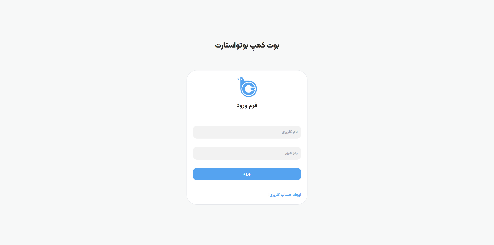
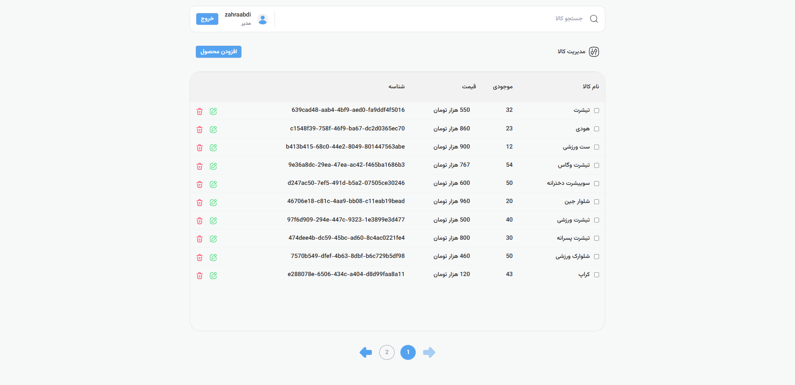
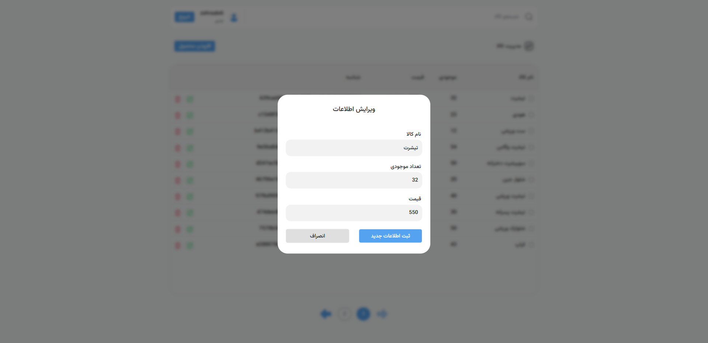

# 🛒 Online Store Admin Panel

This is a **practice project** for building an **Admin Panel for product management** using React and modern libraries.  
The goal of this project is to practice **React Hooks, React Query, form management with React Hook Form + Yup**, and **styling with Tailwind CSS**.

---

## ✨ Features
- User Authentication UI (Register & Login)
- Product listing with **Pagination** and **Search**
- Add new products
- Edit existing products (with Yup validation)
- Delete products (single & bulk)
- Data fetching and cache management with **React Query**
- User-friendly notifications with **React Toastify**
- Modern and responsive UI with **Tailwind CSS**

---

## 🚀 Getting Started

### Download from the repository
```bash
cd server
npm start
cd client
npm install
npm run dev
http://localhost:5173 


```
## 📸 Screenshots

### Login Page


### Product List


### Edit Product Modal

